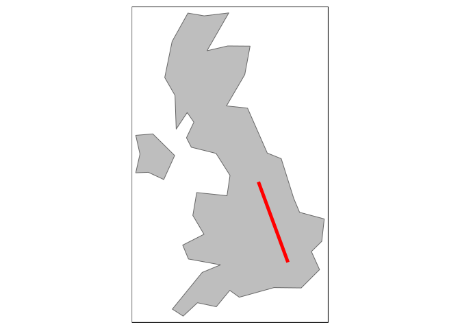

<!-- README.md is generated from README.Rmd. Please edit that file -->
Geocomputation and Data Analysis with R
---------------------------------------

Geocomputation and Data Analysis with R is a 2 day course to be held on the 25<sup>th</sup> and 26<sup>th</sup> April 2019 in the Leeds Institute for Data Analytics (LIDA).

Aim
---

The aim of the course is to get you up-to-speed with high performance geographic processing, analysis and visualisation capabilities from the command-line. The course will be delivered in R, a statistical programming language popular in academia, industry and, increasing, the public sector. It will teach a range of techniques using recently developments in the package [**sf**](https://github.com/r-spatial/sf) and the 'metapackage' [**tidyverse**](https://www.tidyverse.org/), based on the open source book [Geocomputation with R](https://geocompr.robinlovelace.net/) (Lovelace, Nowosad, and Meunchow 2019).

Learning objectives
-------------------

By then end of the course participants should:

-   Be able to use R and RStudio as a powerful Geographic Information System (GIS) <!-- What the different panels within RStudio are and how to use the view panel interactively -->
-   Know how R's spatial capabilities fit within the landscape of open source GIS software <!-- What are the alternatives to R? --> <!-- What are it's strengths/weaknesses? --> <!-- How can R interface to dedicated GIS software like QGIS? -->
-   Be confident with using R's command-line interface (CLI) and scripting capabilities for geographic data processing <!-- autocompletion --> <!-- using help --> <!-- knowing where to search and create a reproducible example to ask questions on a community forum --> <!-- source vs console editor --> <!-- projects and scripts --> <!-- functions / algorithms -->
-   Understand how to import a range of data sources into R <!-- read-in a shapefile --> <!-- write-out a geojson --> <!-- 7.2 Retrieving open data --> <!-- 7.3 Geographic data packages --> <!-- 7.4 Geographic web services --> <!-- 7.5 File formats --> <!-- 7.6 Data Input (I) --> <!-- 7.7 Data output (O) -->
-   Be able to perform a range of attribute operations such as subsetting and joining <!-- 3.2.1 Vector attribute subsetting --> <!-- 3.2.2 Vector attribute aggregation --> <!-- 3.2.3 Vector attribute joining --> <!-- 3.2.4 Creating attributes and removing spatial information -->
-   Understand how to implement a range of spatial data operations including spatial subsetting and spatial aggregation <!-- 4.2.1 Spatial subsetting --> <!-- 4.2.2 Topological relations --> <!-- 4.2.3 Spatial joining --> <!-- 4.2.4 Non-overlapping joins --> <!-- 4.2.5 Spatial data aggregation -->
-   Have the confidence to output the results of geographic research in the form of static and interactive maps <!--     8.2.1 tmap basics --> <!--     8.2.2 Map objects --> <!--     8.2.3 Aesthetics --> <!--     8.2.4 Color settings --> <!--     8.2.5 Layouts --> <!--     8.2.6 Faceted maps --> <!-- 8.4 Interactive maps -->

Location
--------

Leeds Institute for Data Analytics, 40 University Road, LS2 9JT. It can be seen on [OpenStreetMap](https://www.openstreetmap.org/way/84749920), on the [LIDA website](https://lida.leeds.ac.uk/about-lida/contact/) and highlighted in red below (it's a 20 minute walk from the station):


    #> tmap mode set to plotting

Online home
-----------

The course is part of the Geocomputation with R book project.

See the overview slides here: <https://geocompr.github.io/presentations/2day.html#1>

See an overview of the course here: <https://git.io/geocompr-2-day-course>

Course contents
---------------

### Day 1: Foundations

09:00-09:30 Arrival and set-up

09:30-11:00 Introduction to the course and software

<!-- - Introduction to R -->
<!-- - R installation questions/debugging -->
<!-- - How to use RStudio (practical in groups of 2) -->
<!-- - R classes and working with data frames in the **tidyverse** -->
<!-- Idea: get people to say where they are from, how many cups of coffee they drink per week their favourite animal -->
11:15-12:30: R's spatial ecosystem

<!-- - Live demo: using R as a GIS -->
<!-- - Spatial data in R -->
<!-- - R's spatial ecosystem (see section [1.4 of Geocomputation with R - package ecosystem](https://geocompr.robinlovelace.net/intro.html#rs-spatial-ecosystem)) -->
<!-- - Practical: [Work through the exercise 1:3 in Chapter 2](https://geocompr.robinlovelace.net/spatial-class.html#ex2) -->
<!--     - Advanced: complete exercises in Chapter 2 -->
<!--     - Bonus: reproduce the results in the `sf` vignette `sf1` -->
<!-- And example from the PCT -->
**Lunch**

13:30-15:00 The structure of vector geographic data in R and working with attribute data

<!-- - Vector attribute subsetting -->
<!-- - Vector attribute aggregation -->
<!-- - Vector attribute joining -->
<!-- - Creating attributes and removing spatial information -->
<!-- - Exercises: Chapter [3](https://geocompr.robinlovelace.net/attr.html#exercises-1) -->
<!--     - Core: Questions 1:3 and question 9 -->
<!--     - Bonus: complete as many exercises as possible in Chapter 3 -->
15:15-16:30 Spatial data operations

<!-- - Spatial subsetting -->
<!-- - Topological relations -->
<!-- - Spatial joining -->
<!-- - Non-overlapping joins -->
<!-- - Spatial data aggregation -->
<!-- - Exercises: Chapter 4 -->
### Day 2 GIS, visualisation, modelling

09:30-11:00 Reading and writing geographic data

11:15-12:30: Geometric operations

<!-- And example from the PCT -->
**Lunch**

13:30-15:00 Visualisation

15:15-16:30 Working on your own data

Prerequisites
-------------

### Prior experience

**Attendees should already have experience with R.** In addition to being able to complete introductory course such as DataCamp's [introduction to R](https://www.datacamp.com/courses/free-introduction-to-r) free course or equivalent, attendees should **already be using R** for their work. This is not an introductory R course but a course for R users wanting to develop their geospatial analysis skills. If you do not have R experience but already use GIS software and have a strong understanding for geographic data types, and some programming experience, the course may also be appropriate.

In preparation for the course we recommend reading and running the code in these free online resources:

-   The introductory chapter of [R for Data Science](https://r4ds.had.co.nz/introduction.html)
-   Chapter 2 on [setting-up R](https://csgillespie.github.io/efficientR/set-up.html) and section 4.4 on [package selection](https://csgillespie.github.io/efficientR/workflow.html#package-selection) in the book *Efficient R Programming*

### Computing requirements

**Attendees are expected to bring their own laptop with the following packages installed and working.** You can check these are all installed, and install those that are not installed, as follows (you can also just type `install.packages("sf")` etc):

``` r
install.packages("osmdata")   # for working with open street map data
install.packages("sf")        # a package for working with spatial data
install.packages("spData")    # provides example data
install.packages("stplanr")   # a transport data package
install.packages("tidyverse") # metapackage for data science
install.packages("tmap")      # a mapping package

# Make sure your packages are up-to-date with:
update.packages()
```

Reproducible example
--------------------

The code in the following example checks you have the necessary packages installed. It results in a map that will guide you to the location of the course.

**Please ensure the following commands work on your laptop before attending:**

Attach the packages:

``` r
library(sf)
library(tmap)
library(stplanr)
library(tidyverse)
```

The overall route assuming you're travelling from London:

``` r
uk = spData::world %>% 
  filter(name_long == "United Kingdom")
origin_lnd = c(-0.1, 51.5)
destination = c(-1.55, 53.8)
odmatrix = matrix(c(origin_lnd, destination), ncol = 2, byrow = TRUE)
line_lnd = st_linestring(odmatrix) %>% 
  st_sfc() %>% 
  st_sf(crs = 4326)
tm_shape(uk) +
  tm_polygons(col = "grey") +
  tm_shape(line_lnd) +
  tm_lines(col = "red", lwd = 5)
```



Additional exercises
--------------------

### Section 2

-   Use the code in Section 2 to create a map of an OSM element you're interested in.

-   Take a look at the old tutorial Making Maps with R: <https://github.com/Robinlovelace/Creating-maps-in-R>

-   What differences do you notice compared with `sf` objects

### Section 4

-   Use the following commands to get STATS19 point data and cycleway data in Leeds

``` r
library(stats19)
stats19 = stats19::get_stats19(year = 2017, type = "ac", ask = FALSE)
stats19 = stats19[stats19$accident_severity == "Serious", ]
stats19_sf = stats19::format_sf(stats19, lonlat = TRUE)
cycleways = opq("leeds") %>% 
  add_osm_feature(key = "name", value = "Cycle Superhighway 1") %>% 
  osmdata_sf()
```

Note: the saved data can be read-in as follows:

``` r
u = "https://github.com/geocompr/geocompkg/releases/download/0.1/cycleways.Rds"
download.file(u, "cycleways.Rds", mode = "wb")
cycleways = readRDS("cycleways.Rds")
u = "https://github.com/geocompr/geocompkg/releases/download/0.1/stats19_sf.geojson"
stats19_sf = read_sf(u)
```

-   Create a 500 m buffer around the cycleways and subset the crashes that happened within 500 metres of cycleways. The results should look like the image below.


Notes
-----

Welcome to the course!

**Note for day 2:** Do not use the HDI dataset. Use the `lifeExp` column instead.

To be updated as the course progresses

-   Overview slides: <https://geocompr.github.io/presentations/2day.html>

-   Introductory slides can be found here: <https://geocompr.github.io/presentations/intro-to-R.html>

-   I/O slides: <https://geocompr.github.io/presentations/read-write.html#1>

-   Viz slides: <https://geocompr.github.io/presentations/04_viz.html#1>

Resources on for loops:

-   r4ds book: <https://r4ds.had.co.nz/iteration.html>

New R spatial book (work in progress): <https://www.r-spatial.org/book/>

``` r
coffee = readr::read_csv("coffee.csv")
coffee[coffee$likes_herbal_tea, ]
coffee[grepl(pattern = "o", coffee$person_name), ]

names(coffee)
coffee$region_name = coffee$home_region
coffee$home_region = NULL

coffee_sf = dplyr::right_join(pct::pct_regions, coffee)
coffee_sf
plot(coffee_sf$geometry)
library(tidyverse)
coffee %>% 
  slice(2)
coffee[2, ]
```

-   Bonus: create a spatial object representing coffee consumption by region

Note: use Ctl-Shift-M to create the pipe operator

``` r
%>% %>% %>% %>% %>% %>% %>% %>% %>% %>% %>% 
```

### R's spatial ecosystem

Try playing with the map created with these commands

Try changing the basemap

If you are fast, try running the code in the `sf1` vignette

You should be able to open it with:

``` r
vignette("sf1")
```

-   Attribute operations

``` r
library(leaflet)
library(osmdata)
library(tmap)
lida = opq("Leeds") %>% 
  add_osm_feature(key = "name", value = "Worsley Building") %>% 
  osmdata_sf()
road = opq("Leeds") %>% 
  add_osm_feature(key = "name", value = "Albion Street") %>% 
  osmdata_sf()
# m = mapview::mapview(lida$osm_polygons, zoom = 16)
lida_centroid = lida$osm_polygons %>% 
  sf::st_centroid()
lon = sf::st_coordinates(lida_centroid)[1]
lat = sf::st_coordinates(lida_centroid)[2]
m = tm_shape(lida$osm_polygons["name"]) +
  tm_polygons(col = "red") +
  tm_shape(road$osm_lines) +
  tm_lines(lwd = 5) +
  tm_view(set.view = c(lon + 0.005, lat - 0.005, 12)) +
  tm_basemap(server = leaflet::providers$OpenStreetMap) +
  tm_minimap(server = leaflet::providers$OpenTopoMap, zoomLevelOffset = -10) +
  tm_scale_bar()
tmap_mode("view")
m

x = c("a", 1, TRUE)
x[2] + x[3]

x_list = list("a", 1, TRUE)
y = list(1, x_list)
x_list[[3]] + x_list[[2]]

class(road)

albion_street_all = road$osm_lines
albion_street = albion_street_all[albion_street_all$highway == "pedestrian", ]

class(albion_street)
names(albion_street)

attributes(albion_street)
albion_street$geometry[[1]]
unclass(albion_street$geometry[[1]])
class(.Last.value)

albion_street_projected = st_transform(x = albion_street,
                                           crs = 27700)

albion_street_buffer = st_buffer(x = albion_street_projected, dist = 100)
plot(albion_street_buffer$geometry)
mapview(albion_street_buffer)

albion_street_all
st_crs(albion_street_all)
albion_street_all = st_transform(albion_street_all, 27700)

albion_spatial_subset = albion_street_all[albion_street_buffer, ]
mapview(albion_spatial_subset)
world
plot(world)

world$is_small = world$pop > 10000000
summary(world$is_small)

world_continents = world %>% 
  group_by(continent) %>% 
  summarise(
    n = n(),
    n_small = sum(is_small, na.rm = TRUE)
    )

coffee_data

world_coffee = inner_join(world["name_long"] , coffee_data)
plot(world_coffee)
```

### Spatial operations

``` r
library(sf)
library(spData)
nz = spData::nz
plot(nz)
nz_height
canterbury = nz[nz$Name == "Canterbury", ]
canterbury_points = nz_height[canterbury, ]
canterbury_points = nz_height[canterbury, , op = st_intersects]
plot(nz$geom)
plot(canterbury, col = "red", add = TRUE)
plot(nz_height, add = TRUE, col = "grey")
plot(canterbury_points, add = TRUE)

point_joined = st_join(nz_height, nz["Name"])
nz_joined = st_join(nz, nz_height) %>% 
  filter(!is.na(elevation))

summary(nz_height$elevation)

summary(is.na(nz_joined$elevation))

res = nz_joined %>% 
  group_by(Name) %>% 
  summarise(n = n()) %>% 
  arrange(desc(n)) 
  # slice(2) %>% 
  # pull(Name)
plot(res)

point_aggregated1 = aggregate(nz_height["elevation"], nz, FUN = mean)
plot(point_aggregated1)

library(dplyr)
point_aggregated2 = nz_joined %>% 
  group_by(Name) %>% 
  summarise(av_height = mean(elevation))
plot(point_aggregated2)
st_crs(nz)
```

-   Geographic data I/O

``` r
library(stats19)
# example of data package 
a = get_stats19(year = 2017, type = "acc", ask = FALSE)
a_sf = format_sf(a)
plot(a_sf[1:99, "accident_severity"])

xy = read.csv(text = 
"lon,lat,v1
0,50,a
0,60,b
-30,-20,c")

library(sf)
xy_sf = st_as_sf(xy, coords = c("lon", "lat"))
st_crs(xy_sf) = 4326
st_crs(xy_sf)
plot(spData::world$geom)
plot(xy_sf, add = T)

library(spData)
saveRDS(nz, "nz.Rds")
write_sf(nz, "nz.gpkg")
dir.create("new_directory")
file.create("new_directory/new-file.R")
file.remove("new_directory")
list.dirs(recursive = FALSE)
write_sf(nz, "nz.geojson")
write_sf(nz, "nz.geopkg")
write_sf(nz, "nz.shp")
f = list.files(pattern = "nz.")
f_sizes = file.size(f)
f_df = tibble::tibble(f, f_sizes)
dplyr::arrange(f_df, desc(f_sizes))


uruguay = rnaturalearth::ne_countries(
  scale = "medium",
  type = "countries",
  country = "uruguay",
  returnclass = "sf"
  )
  plot(uruguay)
mapview::mapview(uruguay)
```

Shortcut: Alt-Shift-Down: copy lines down Shortcut: Ctl-Shift-A: nicely formats your code

``` r
library(osmdata)
a1010_osm = opq("england") %>% 
  add_osm_feature(key = "ref", value = "A1010") %>% 
  osmdata_sf()
mapview::mapview(a1010_osm$osm_lines)

a1010 = st_transform(a1010_osm$osm_lines, 27700)

# identical result with pipe
a1010 = a1010_osm$osm_lines %>% 
  st_transform(27700) %>% 
  st_union()

a1010_df = st_sf(data.frame(name = "A1010"), geometry = a1010)

class(a1010)
st_crs(a1010)

a1010_buffer = a1010 %>% st_buffer(30)

library(stats19)
crashes = get_stats19(year = 2017, type = "ac", ask = F)
crashes_sf = format_sf(crashes)
crashes_sf = crashes_sf[crashes_sf$accident_severity == "Serious", ]
crashes_a1010 = crashes_sf[a1010_buffer, ]
plot(a1010_buffer)
mapview::mapview(a1010_buffer) + mapview::mapview(crashes_a1010)

co = sf.colors(n = 4)
q = quantile(nz$Median_income)
nz$income_bands = cut(nz$Median_income, breaks = q)
nz$co = factor(nz$income_bands)
nz$cols = factor(nz$co, labels = co)
nz$cols = as.character(nz$cols)

library(tmap)
tmap_mode("view")
tm_shape(nz) +
  tm_fill("Median_income", 
          palette = "-magma") +
  tm_borders(col = "red") +
  tm_shape(nz_height) +
  tm_dots() +
  tm_scale_bar() +
  tm_compass()

tmaptools::palette_explorer()
```

References
----------

Lovelace, Robin, Jakub Nowosad, and Jannes Meunchow. 2019. *Geocomputation with R*. CRC Press.
